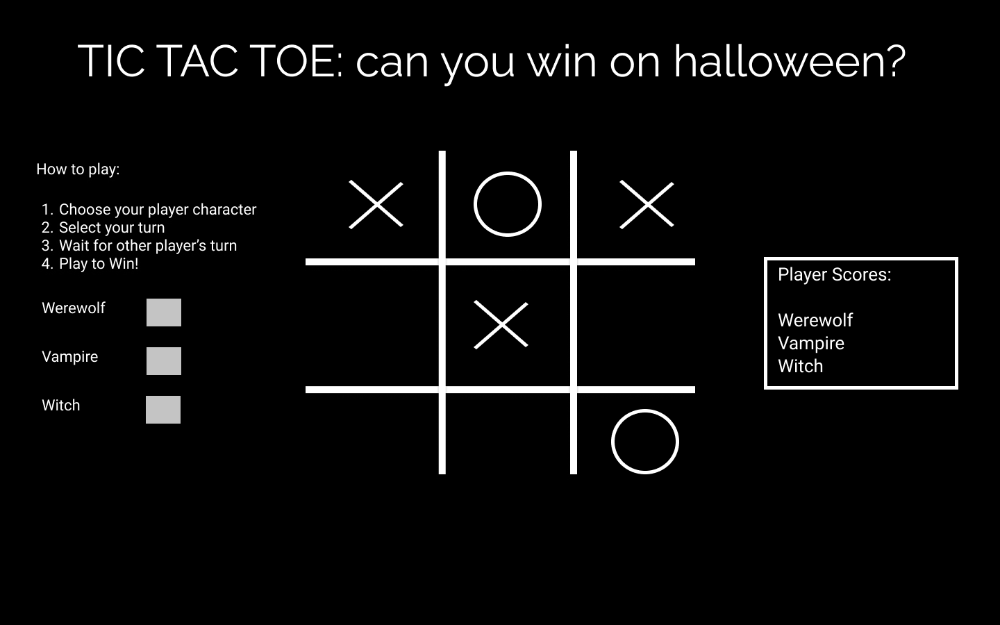
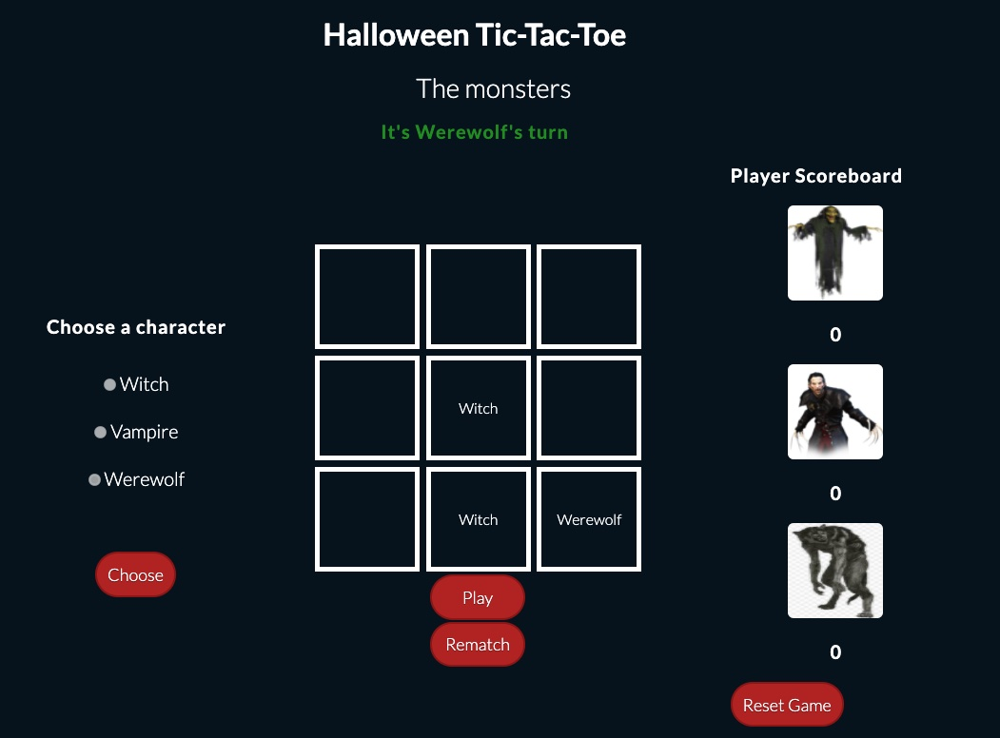

# tic-tac-toe

---

> Be afraid...Be very afraid

---
## Gameboard (First Draft)

*Designed on figma*

---
### How to play
1. Choose a player: "Werewolf", "Witch", "Vampire"
2. Make the first move on the board:
3. Aim to win!
4. Reset the game to play again
5. Check your player's scoreboard

### Gameboard (Final Draft)

---
### Important Files
* css
* javascript
* html

---
### How to develop the game
* Develop another gameboard
* Amend CSS styling to ensure supported across all browsers
* Amend header and reset button
* Refine JS

---
### Version History
*Version 1.0
